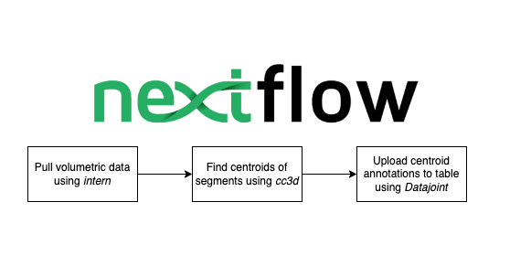

# BossDB x DataJoint x NextFlow Demo

This repo is a example of how to use nextflow to quickly run scalable and containerized workflows.



## Whats included

- Example of a containarized workflow that 
    - pulls volumetric data from the Kasthuri dataset using `intern`, the python SDK for `BossDB`
    - finds segment centroids for from a segmentation volume using `cc3d`, a connected-components library optimized for 3D volumes
    - and uploads the resultant annotations to a locally-deployed `DataJoint` database.
- Configuration settings and docker images to allow for easy customization or templating of this repo for other projects.

## Requirements

1. docker and docker-compose
2. Java `jdk` version 11 or above 
2. POSIX compatible system to download and run `nextflow` in the command line.

## How to run

Simply run the `set-up.sh` script to install nextflow, add it to your path, and run the docker-compose YAML. This script will take around 5 minutes to build the docker images.

```bash
./set-up.sh
```

Then, run the nextflow workflow file located in the `incf-demo/workflow` directory.

```bash
cd incf-demo/workflow
nextflow run incf-demo.nf -with-report report.html 
```

You can then examine the outputs generated by `nextflow` in the `work` directory, which should be generated upon workflow completion. 

## Acknowledgements and References

- [Seung Lab's cc3d](https://github.com/seung-lab/connected-components-3d) 
- [DataJoint](https://datajoint.com/)
- [BossDB](https://bossdb.org/)
- [Kasthuri Dataset](https://bossdb.org/project/kasthuri2015)