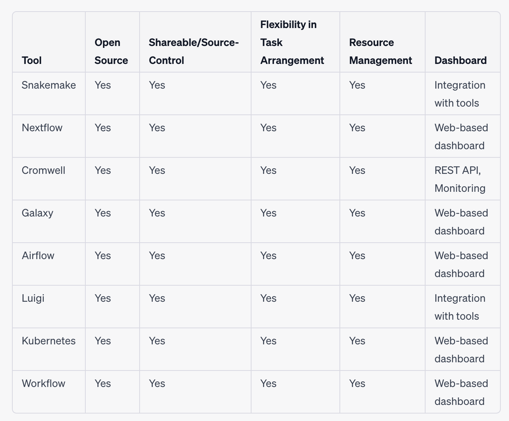

# Low-cost Workflow Orchestration Systems

This repository aims to explore low-cost workflow orchestration systems that possess the following features: open-source, shareable and source-controllable, provide flexibility in task arrangement (optional inputs/output and dependency graph), offer resource management capabilities (specifying the number of cores, memory, GPU), and preferably include a dashboard. A concise summary of this comparative analysis is presented below.

For this demonstration, we decided to proceed with Nextflow due to its widespread adoption within the scientific community. This demonstrates usage of nextflow for neuroimaging workflows with BossDB and DataJoint.

Please see local_nextflow/README.md

---

## Nextflow

- **Portability and Reproducibility**: Nextflow workflows are written in a domain-specific language (DSL) that is both human-readable and platform-agnostic. This allows workflows to be easily shared and executed across different computing environments, including local machines, clusters, and cloud platforms. Nextflow ensures reproducibility by providing explicit control over software dependencies and data versions used in the workflow.

- **Flexibility**: Nextflow provides a flexible and extensible framework for defining workflows. It supports a wide range of programming languages, allowing you to integrate existing scripts or tools seamlessly. Nextflow also offers built-in support for containerization technologies like Docker and Singularity, enabling encapsulation of software dependencies and ensuring consistent execution across different environments.

- **Scalability**: Nextflow is designed to handle large-scale computational workloads. It supports parallel and distributed execution, allowing workflows to be efficiently executed across multiple compute resources. Nextflow automatically manages task scheduling and data parallelism, enabling optimal resource utilization and efficient scaling.

- **Fault-tolerance**: Nextflow incorporates robust error handling and recovery mechanisms. It automatically detects and handles failures during workflow execution, providing options for task rescheduling and retrying failed tasks. This helps to ensure that workflows continue running smoothly even in the presence of transient errors or system failures.

- **Community and Ecosystem**: Nextflow has a thriving community of users and developers, which results in an active ecosystem. Users can leverage a rich collection of pre-existing workflow templates and community-contributed processes, making it easier to get started with complex analysis tasks. The community also provides support and resources for troubleshooting and sharing best practices.

- **Integration with Big Data Technologies**: Nextflow integrates well with popular big data technologies such as Apache Spark and Apache Hadoop, allowing seamless integration of large-scale data processing and analysis tasks into workflows. This makes Nextflow suitable for handling data-intensive workflows that involve big data processing and analysis.

---

## Survey of Other tools

**Snakemake**:

- **Open source**: Yes, Snakemake is open source.

- **Shareable/source-controllable**: Workflows written in Snakemake can be shared and version-controlled like any other source code.

- **Flexibility with task arrangement**: Snakemake provides a flexible rule-based approach for task arrangement, allowing optional inputs/outputs and dependency graph specification.

- **Resource management**: Snakemake supports specifying resource requirements such as the number of cores and memory for individual tasks.

- **Dashboard**: Snakemake does not have a built-in dashboard, but it provides integration with external tools like D3.js for generating visualizations of workflow execution.

**Workflow**:

- **Open source**: Yes, Workflow is open source.

- **Shareable/source-controllable**: Workflows written in Workflow can be shared and version-controlled.

- **Flexibility with task arrangement**: Workflow offers flexibility in task arrangement using a directed acyclic graph (DAG) model, allowing optional inputs/outputs and dependency graph specification.

- **Resource management**: Workflow supports specifying resource requirements for tasks, including CPU cores and memory.

- **Dashboard**: Workflow provides a built-in web-based user interface that serves as a dashboard for managing and monitoring workflows.

**Cromwell**:

- **Open source**: Yes, Cromwell is open source.

- **Shareable/source-controllable**: Yes, workflows written in WDL can be shared and version-controlled.

- **Flexibility with task arrangement**: Cromwell supports flexible task arrangement with options for optional inputs/outputs and dependency graphs.

- **Resource management**: Cromwell allows users to specify resource requirements such as the number of cores, memory, and GPUs for each task.

- **Dashboard**: Cromwell does not have a built-in dashboard, but it provides a REST API and integration with monitoring tools for tracking workflow status.

**Galaxy**:

- **Open source**: Yes, Galaxy is open source.

- **Shareable/source-controllable**: Workflows in Galaxy can be shared and version-controlled.

- **Flexibility with task arrangement**: Galaxy provides a graphical user interface (GUI) for creating workflows, allowing flexibility in arranging tasks and specifying dependencies.

- **Resource management**: Galaxy supports specifying resource requirements for individual tools within workflows.

- **Dashboard**: Galaxy has a web-based interface that serves as a dashboard for creating, running, and monitoring workflows.

**Airflow**:

- **Open source**: Yes, Airflow is open source.

- **Shareable/source-controllable**: Workflows in Airflow can be shared and version-controlled.

- **Flexibility with task arrangement**: Airflow allows for flexible task arrangement through directed acyclic graphs (DAGs), enabling optional inputs/outputs and dependency graphs.

- **Resource management**: Airflow provides mechanisms for specifying resource requirements for tasks, such as the number of cores and memory.

- **Dashboard**: Airflow includes a web-based user interface that serves as a dashboard for managing and monitoring workflows.

**Luigi**:

- **Open source**: Yes, Luigi is open source.

- **Shareable/source-controllable**: Workflows in Luigi can be shared and version-controlled.

- **Flexibility with task arrangement**: Luigi offers flexibility in task arrangement through Python scripting, allowing optional inputs/outputs and dependency graphs.

- **Resource management**: Luigi allows users to specify resource requirements for tasks, but it may require custom implementation depending on the execution environment.

- **Dashboard**: Luigi does not have a built-in dashboard, but it provides hooks and integration capabilities with external monitoring tools.

**Kubernetes**:

- **Open source**: Yes, Kubernetes is open source.

- **Shareable/source-controllable**: Workflows defined in Kubernetes can be shared and version-controlled along with other Kubernetes resources.

- **Flexibility with task arrangement**: Kubernetes provides flexibility in arranging tasks through its resource definitions and dependencies.

- **Resource management**: Kubernetes allows users to specify resource requirements, such as CPU, memory, and GPU, for individual tasks through container resource requests and limits.

- **Dashboard**: Kubernetes has a web-based dashboard that provides monitoring and management capabilities, including workflow status.

---
Note: Keep in mind that the choice of orchestration tool ultimately depends on specific requirements, preferences, and the nature of the workflow. Other tools like Apache Airflow, Cromwell, and Snakemake also offer their own set of advantages and may be more suitable for certain use cases.
